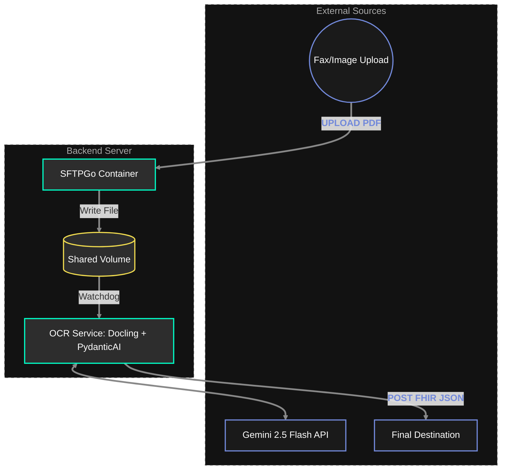

# Auto-Chart System Architecture

This document outlines the architecture for the OCR-to-FHIR pipeline, optimized for using Docker and PydanticAI.

## 1. System Overview

The system automates the extraction of patient data from faxed or uploaded documents/images and maps them into FHIR-compliant JSON resources.

